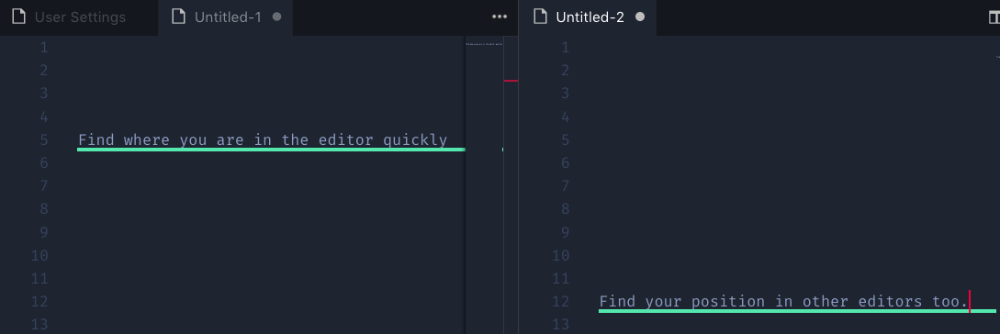
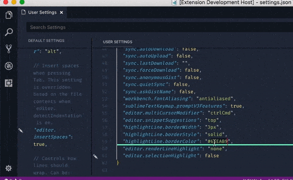

# Highlight Line VS Code

Enhanced highlighting of the currently active line in your text editor.

## Features 

### Multi-Tab Line Highlighting

Line highlighting is provided & preserved across multiple tabs, so it's easier to find where you left off in a tab.

>

## Customizable Settings

Through the configuration options, you can edit appearance of your hilighted line and see the changes take effect immediately in your editor. 

>

<table>
  <tr>
    <th colspan="2">Highlight Line Settings</th>
  </tr>

  <tr align="left">
    <th>Name</th>
    <th>Description</th>
  </tr>

  <tr>
    <td><code>highlightLine.borderColor</code></td>
    <td>Specifies the border color used & is changable to any valid CSS color value. For example here are a list of valid values: `'red'`, `'#FFF'` `'#FFFFFFF'`, `'RGB(255,255,255)'`, `'RGB(255, 255, 255. 0.5)'`</td>
  </tr>
  <tr>
    <td><code>highlightLine.borderWidth</code></td>
    <td>Specifies the width of the border in pixels For example: `'2px'`</></td>
  </tr>
  <tr>
    <td><code>highlightLine.borderStyle</code></td>
    <td>Specifies the border style of the line. For example, here a a list of valid values: `solid`, `dashed`, `inset`, `double`, `groove`, `outset`, `ridge`</td>
  </tr>
  </table>

### Thank You
> Thanks checking out my extension! I'm mostly hang out on [twitter](https://twitter.com/cliffordfajard0), ask me questions or let's talk!

